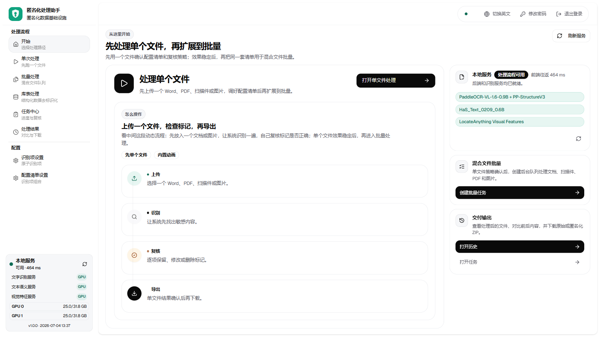
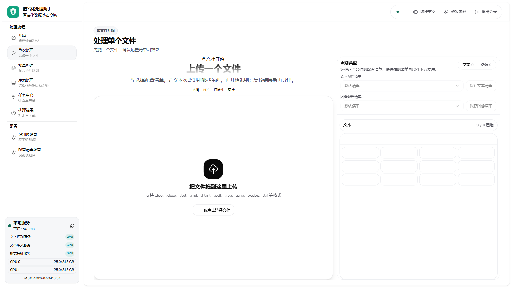
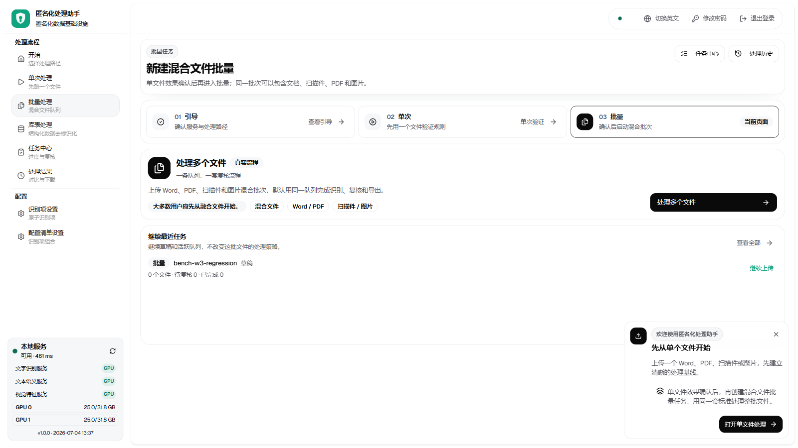
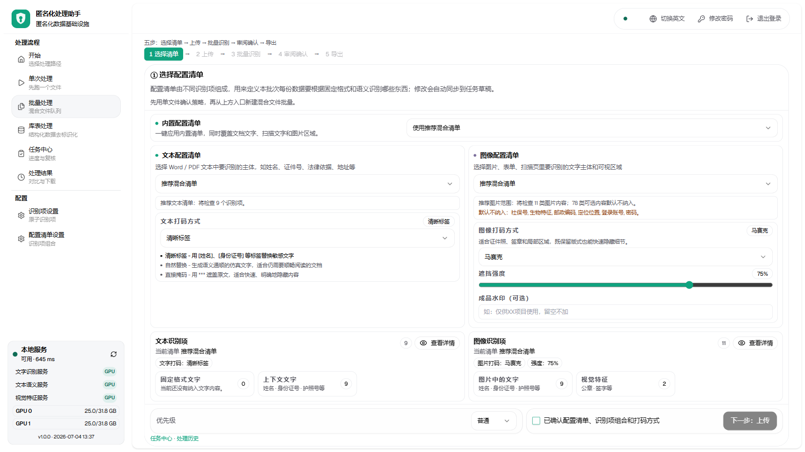
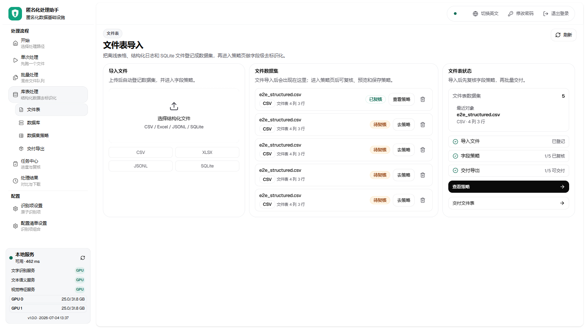
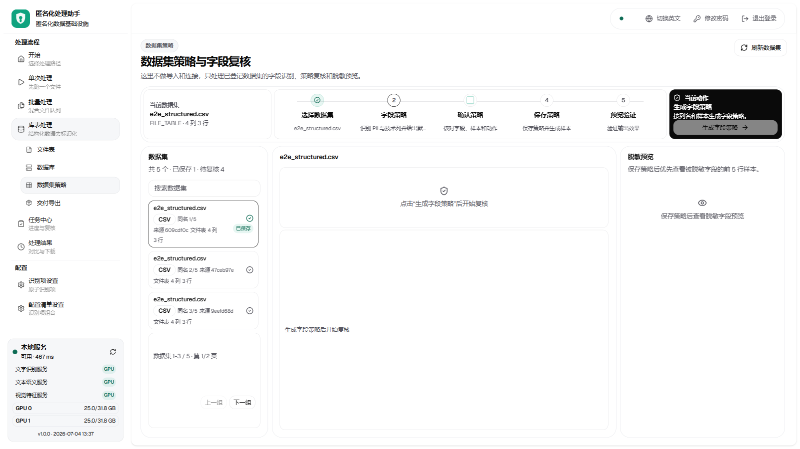
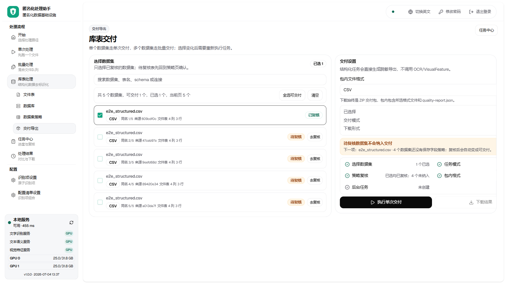
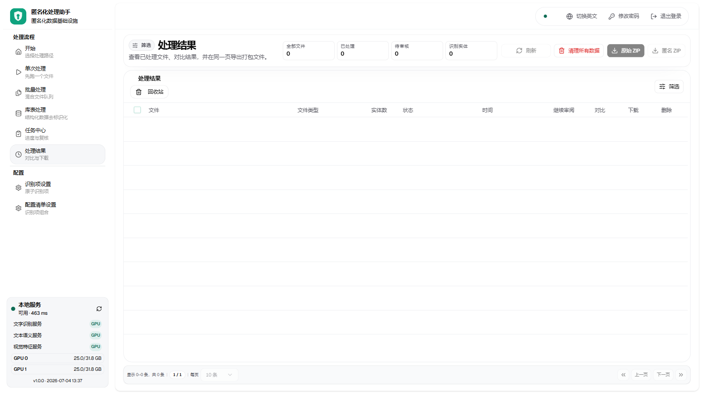
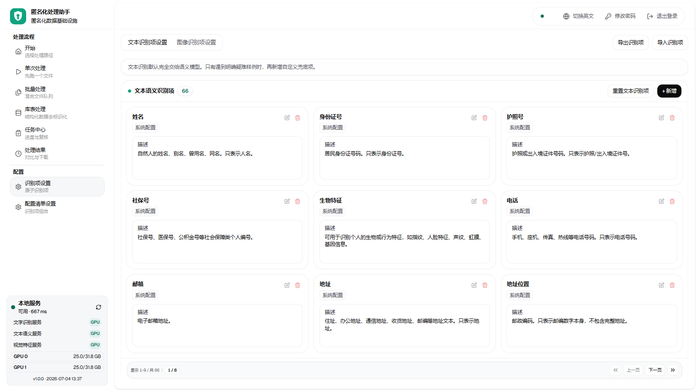

# 数据匿名化流通利用基础设施 · 操作手册

适用版本 v1.0.0 ｜ 截图均取自真实运行环境（版本与构建时间见界面左下角）

---

## 1. 登录与账号


- 首次部署：第一个注册的账号自动成为管理员；后续账号由管理员在「系统设置 › 权限信息」创建，或开放自助注册（默认普通角色）。
- 修改密码：页面右上角「修改密码」，验证当前密码后设置新密码，本次登录保持有效，其他设备自动下线。
- 角色一览：**管理员**（全部+用户管理）／**审核员**（完整流程，可被授予批量确认）／**普通用户**（同审核员）／**操作员**（上传/识别/导出，不可确认审核）／**只读**（仅查看）。

## 2. 开始页与处理路径



左侧导航即处理路径：先用「单次处理」跑通一个文件验证识别配置，再进入「批量处理」；结构化数据走「库表处理」；进度与结果在「任务中心」「处理结果」。左下角为本地模型服务状态与 GPU/数据盘水位。

## 3. 单次处理（单文件工作台）



1. 拖入文件（Word/PDF/图片/扫描件），识别自动开始；
2. 左侧原文、右侧匿名化预览、右栏实体清单（可逐项勾选/取消）；
3. 点「确认匿名化」生成成品，可下载或进入对比视图。

## 4. 批量处理（五步向导）




1. **选择清单**：选行业预设（法律/医疗/金融/政务）或自定义识别项组合，勾选确认后进入上传；
2. **上传**：支持批量拖入；大文件自动分块断点续传，断网恢复后点「重试失败文件」续传；
3. **批量识别**：提交后台队列，进度实时可见，可先审已完成的文件；
4. **审阅确认**：逐份复核（快捷键 **← / → 切换文件，Ctrl+Enter 确认**）；获授权者可用「一键确认剩余全部」跳过逐份复核（不可撤销，弹窗二次确认）；
5. **导出**：打包下载成品；超过 200 份自动切换异步分卷导出（先秒回预估大小，再逐卷下载）；可导出质量报告与明细 CSV。

## 5. 库表处理（结构化数据）





1. **文件表**：导入 CSV/XLSX/JSONL/SQLite（或「数据库」页直连 PostgreSQL/MySQL 读取）；
2. **数据集策略**：点「生成字段策略」自动识别各列 PII 与建议动作（掩码/令牌化/保留），逐页确认后「保存并生成预览」；
3. **交付导出**：勾选已复核数据集创建交付任务，产出 ZIP 交付包（含脱敏数据与 quality-report.json）。十万行级表格自动按 5 万行分卷，Excel 可直接打开。

## 6. 任务中心与处理结果



任务中心跟踪批量任务进度、复核与驳回；处理结果页对比原文/成品并下载。所有文件按账号隔离，互不可见。

## 7. 识别项与配置清单



「识别项设置」管理原子识别项（可新建正则类自定义项）；「配置清单设置」把识别项组合成清单并保存为预设，四个行业预设开箱即用。

## 8. 管理员功能（系统设置）

- **运行配置**：调节任务并发数；
- **权限信息**：创建账号、分配五种角色、为指定员工开启「批量确认」；
- **审计日志**：按用户/动作/关键字检索"谁在何时上传/确认/导出了什么"，一键导出 CSV；
- **服务监控**：模型服务状态、双卡显存、数据盘水位。
- 数据保留策略：部署侧配置 `DATA_RETENTION_DAYS`（默认关闭），开启后超龄文件自动清理并留审计。

## 8.5 企业集成（第二轮新增）

**成品水印**：单次处理右侧「成品水印（可选）」输入框，或批量第 1 步图像配置卡内输入水印文案（如「仅供XX项目使用」）；留空不加。水印平铺在导出的图像与 PDF 成品上，预览不受影响。

**任务完成通知**：批量识别完成、批量确认落定时页内弹提示；若浏览器页签切到后台，会发送系统通知（首次使用会请求通知权限，请点击允许）。

**授权许可（管理员）**：系统设置 → 授权许可。查看授权状态/客户/到期日/席位/行业包；供应商提供的续期证书（license.json）可直接在此上传安装，立即生效无需重启。授权到期前 30 天登录页会出现提醒横幅；过期后进入只读宽限期（数据可看可导出，不可新建任务）。

**LDAP/AD 登录（管理员）**：由部署工程师在服务端配置启用（LDAP_ENABLED 等环境变量）。启用后员工用域账号密码登录，角色按 AD 组自动映射；管理员始终可用本地账号登录（目录故障兜底）。

**品牌定制（交付工程师）**：构建时设置 VITE_BRAND_NAME / VITE_BRAND_TAGLINE / VITE_BRAND_LOGO / VITE_BRAND_COLOR 四个变量即可整站换品牌名/标语/Logo/主色。

## 8.6 数据安全与运维（第三轮新增）

**回收站**：处理结果页标题旁「回收站」按钮。删除的文件保留 7 天，可「还原」或「彻底删除」；超期自动清除。

**账号禁用（管理员）**：系统设置 → 权限信息。禁用后该账号立即无法登录（已登录的会话也随即失效）；不能禁用自己或最后一个管理员。

**API 密钥（管理员）**：供外部系统对接。创建时明文只显示一次，请当场复制保存；只读密钥不能做任何修改操作；可随时吊销。调用方式：请求头 X-API-Key: rk_xxx。

**备份与恢复（运维）**：数据库与配置每小时自动备份；文件树备份与恢复流程见 backend/docs/backup-restore.md（含停服恢复 CLI 用法）。服务监控面板可见备份新鲜度。

## 8.7 内网大批量接入（服务器目录导入）

文件在内网另一台服务器上时，不必经办公电脑浏览器上传：

1. 运维把文件拷到平台服务器的导入目录（scp / rsync / 共享盘均可）：
   ```bash
   scp -r /源目录/*.pdf 平台服务器:~/redaction-deploy/backend/data/import_inbox/<你的用户名>/
   ```
2. 批量处理第 2 步点「从服务器目录导入」→ 刷新 → 勾选 → 导入。
   导入是服务器本地操作（move），万级文件秒-分钟级完成，不占任何上传带宽。
3. 说明：每个账号只能看到自己子目录的文件；导入即从目录搬走；伪造扩展名的文件会留在原地并提示原因。

**方式二：远程 SFTP 拉取**——同一个「从服务器目录导入」对话框切到「远程服务器 (SFTP)」标签：新增源（主机/账号/密码或私钥/根目录）→浏览目录→勾选→拉取。平台直接从对方服务器取文件，全程不经办公电脑；凭据加密存储，路径锁定在配置的根目录内。运维可用 SFTP_HOST_ALLOWLIST 环境变量限制可连主机。SMB/NFS 场景建议挂载到平台机后走方式一。

技术对接备选：外部系统也可用 API 密钥直接调上传接口（系统设置 → 授权许可 → API 密钥），内网直传不经办公电脑。

## 9. 常见问题

| 问题 | 处理 |
|---|---|
| 上传中断网，文件传不上去 | 恢复网络后点错误卡片里的「重试失败文件」；大文件自动从断点续传 |
| 批量确认按钮是灰的 | 需管理员在「权限信息」为你的账号开启「批量确认」 |
| 多页文件确认按钮点不动 | 需先浏览完所有有命中的页面（页脚有「下一个未读页」快捷按钮） |
| 导出提示分卷 | 属正常：大批量自动分卷（每卷 ≤2GB），逐卷下载后一并解压 |
| 只读账号无法操作 | 该角色按设计仅可查看，请管理员调整角色 |

---
运维（安装/升级/备份）见 `deploy/RUNBOOK.md`；性能与识别质量数据见 `docs/性能与质量白皮书.md`。
